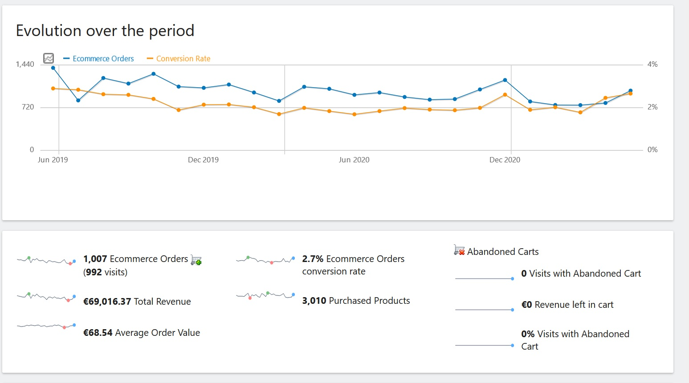
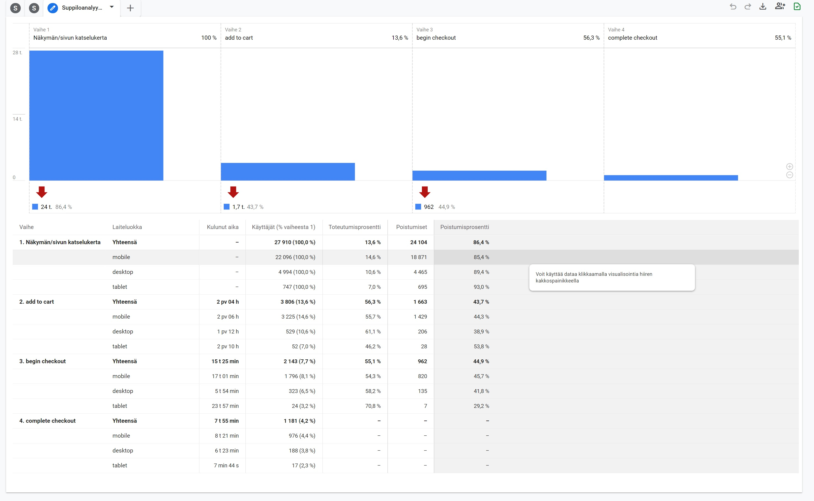
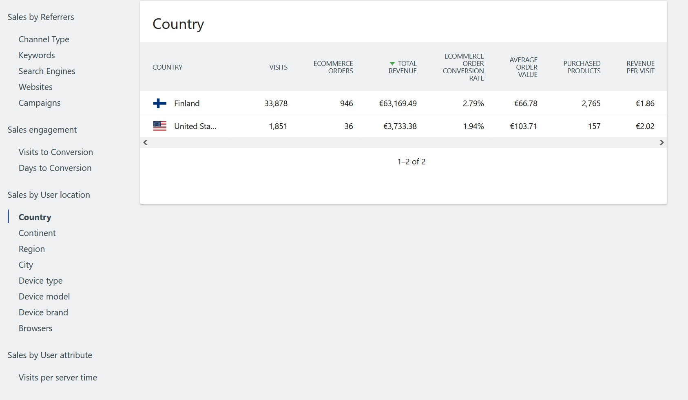
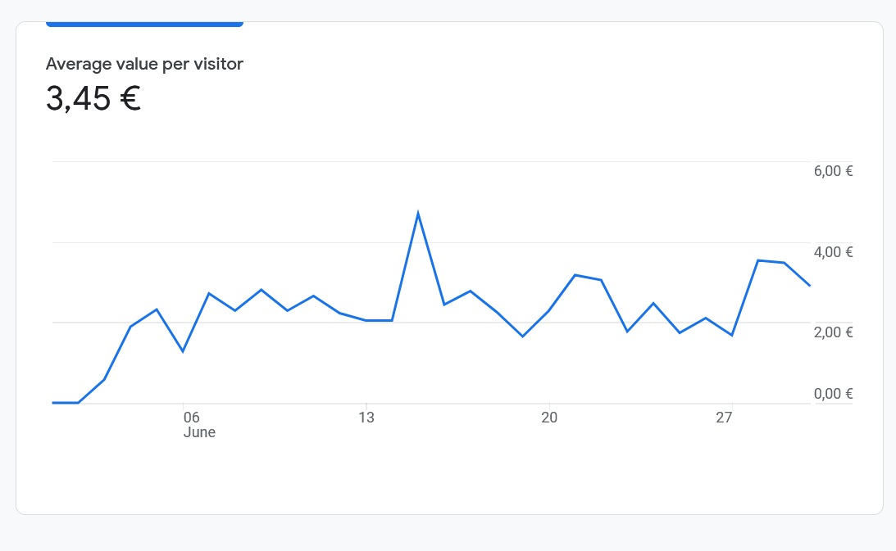

- [Initial results](#initial-results)
- [What are we measuring?](#what-are-we-measuring)
  - [Conversion rate](#conversion-rate)
  - [Average value per visitor](#average-value-per-visitor)
  - [Google Analytics 4](#google-analytics-4)
- [Blink-cart](#blink-cart)

# Initial results

After moving from Prestashop to <a href="https://blink-cart.com" target="_blank">React</a> a few months ago, we started seeing improvements on the conversion rates and the average value per visit.

# What are we measuring?

We measured about 30 000 visits on React and compared our results to our earlier results with Prestashop (approx. same amount of visits). We are most interested in the conversion rate (from visit to purchase) and the average value per visitor. The results with React are impressive compared to our earlier Prestashop site.

## Conversion rate

Our conversion rate has increased from 2,7% to 4,2%. That is more than a 55 percent increase.

**Prestashop conversion rate**

**React conversion rate**

## Average value per visitor

Also our average value per visitor has increased - with Prestashop it was 1,86€ and after our migration to React we have seen an impressive 85% increase to 3,45€.

**Prestashop value per visitor**

**React value per visitor**

## Google Analytics 4

When migrating to React we also moved our analytics data to new Google Analytics 4 which explains the different look of the screenshots.
This might explain some of the difference in the analytics data - but we double checked the order data with our Prestashop back end. So that should eliminate any statistical errors.

We will continue to monitor the analytics data in the coming months to see if our good results continue to persist.

# Blink-cart

If you are interested in trying out how your catalogue would look like in React, you should visit <a href="https://blink-cart.com" target="_blank">Blink-cart.com</a> to get a demo setup in 5 minutes or less.
