- [Why React](#why-react)
- [Blink-cart](#blink-cart)
- [Results](#results)
  - [Mobile](#mobile)
    - [Prestashop results on mobile](#prestashop-results-on-mobile)
    - [React results on mobile](#react-results-on-mobile)
  - [Desktop](#desktop)
    - [Prestashop results on desktop](#prestashop-results-on-desktop)
    - [React results on desktop](#react-results-on-desktop)
  - [Summary](#summary)
- [30.6.2021 Update](#3062021-update)

# Why React

Our strategy is highly dependant on driving organic traffic to our site. For this reason, Google is very important to us. For some time Google has been emphasizing that the speed and their usability metrics will have an ever-increasing impact on page rankings on Google search.

We have been struggling with the speed of our Prestashop site. Either we would have to use just the barebones modules/theme or have poor performance.

# Blink-cart

Then I came across <a href="https://blink-cart.com" target="_blank">Blink-cart.com</a> and their offer of turning a Prestashop or a Magento site into a super fast React site (SPA, Single page application) was very appealing. The way it works is that the back end will use Prestashop but the front end will use a custom, React-powered theme (using GatsbyJS framework). The data will be pulled from Prestashop using a series of APIs and Prestashop webservice.

After talking with their team, we started work on our project. <a href="https://www.hersecret.fi/" target="_blank">Our shop</a> needed some extra work since we use a few custom plugins that we absolutely needed to include, e.g. a custom reviews module and a Perfect size widget. But they were happy to work with us to design a perfect solution for us.

# Results

Here we compare three of the main pages of any e-commerce store - a homepage, a category page and a product page. The results are measured using the Googles Pagespeed insights.

## Mobile

First let's take a look at the mobile results as that is where most of the traffic is and also what Google values the most (after all, we all like to please Google).

### Prestashop results on mobile

The homepage has quite a lot of elements so it might not be very comparable to the minimal React front page. But the category pages and the product pages are very similar visually so we will put more emphasis on those.

**Homepage**
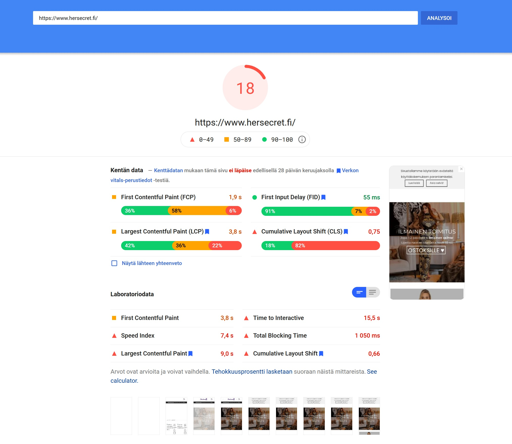

**Category page**
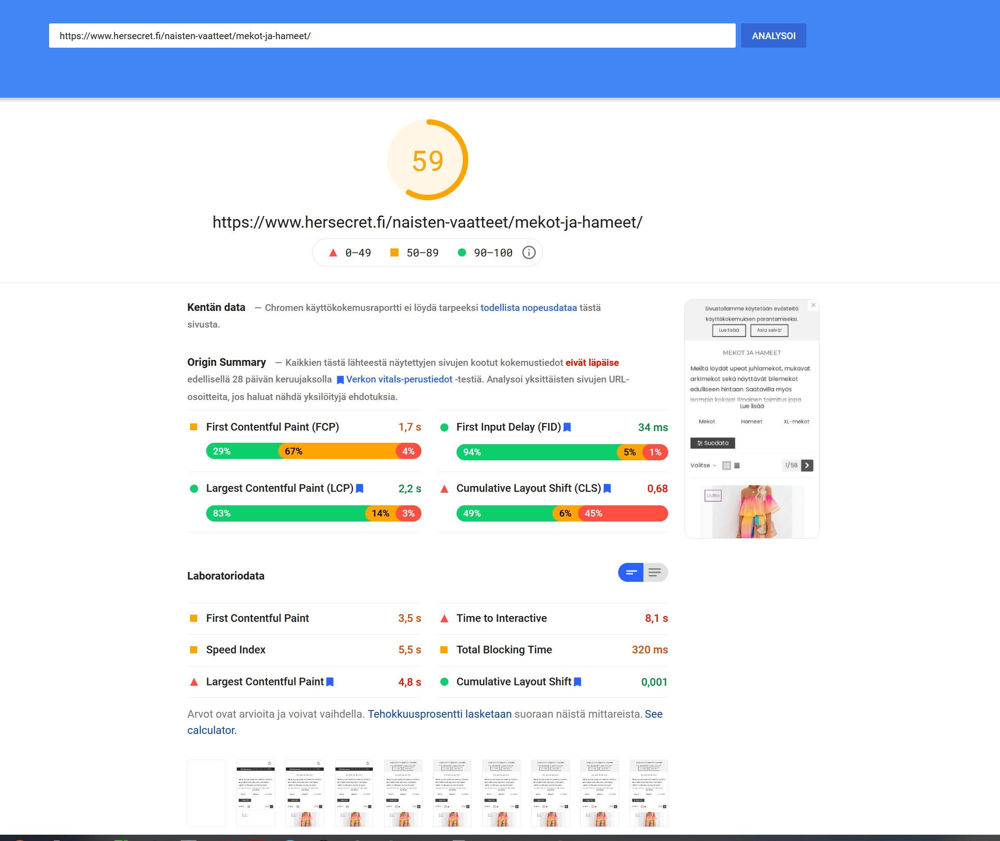

**Product page**
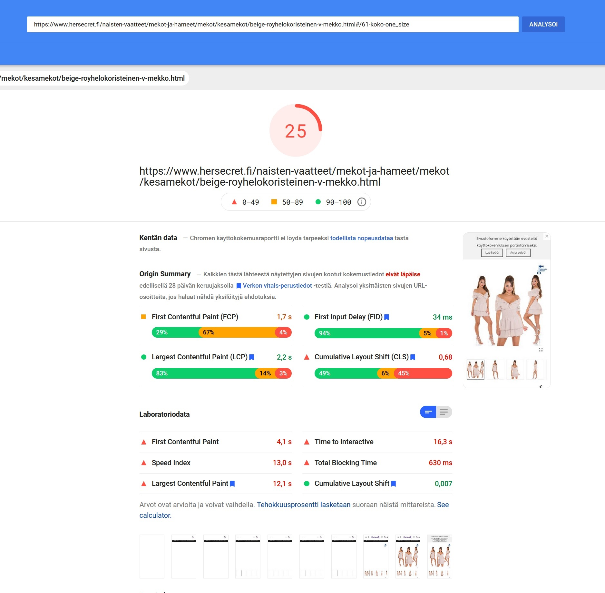

As you can see, our most important pages (Product pages) leave a lot be desired.

### React results on mobile

**Homepage**
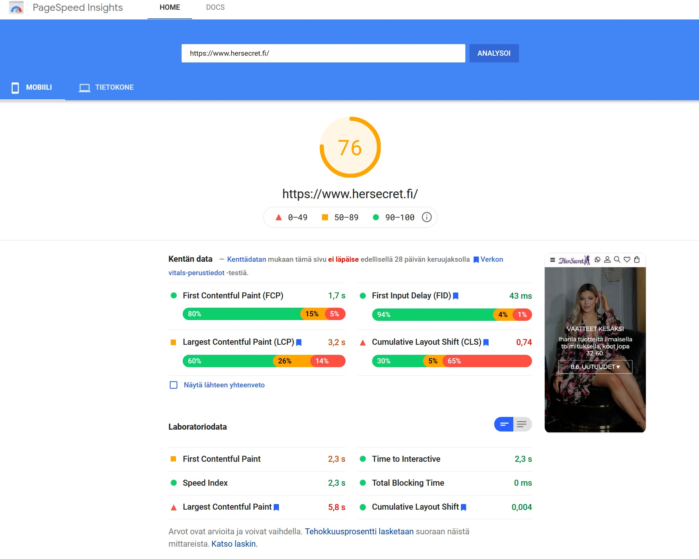

**Category page**
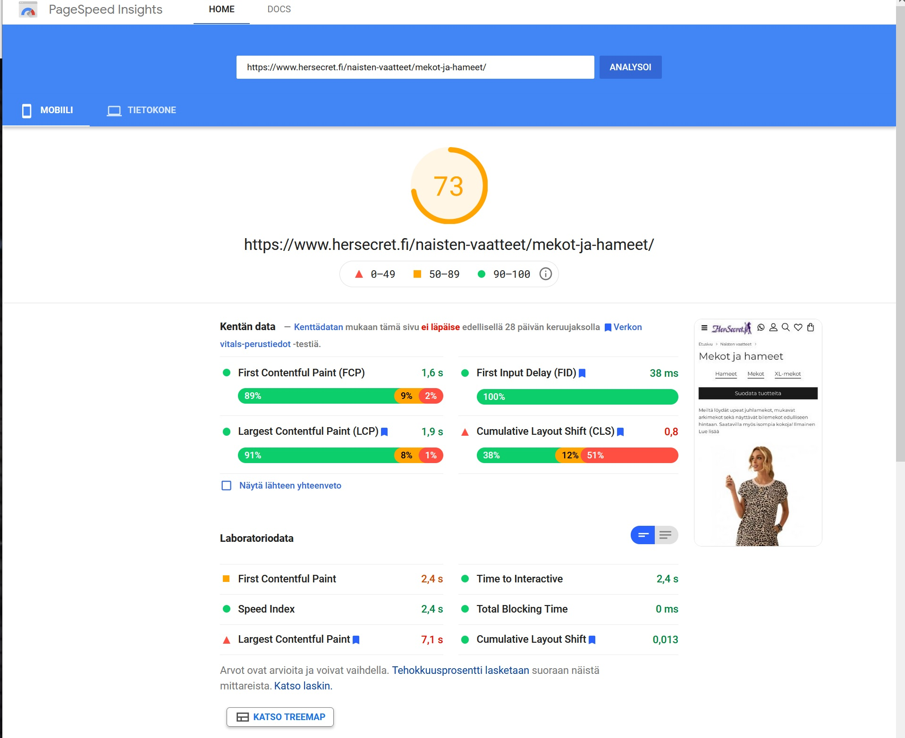

**Product page**
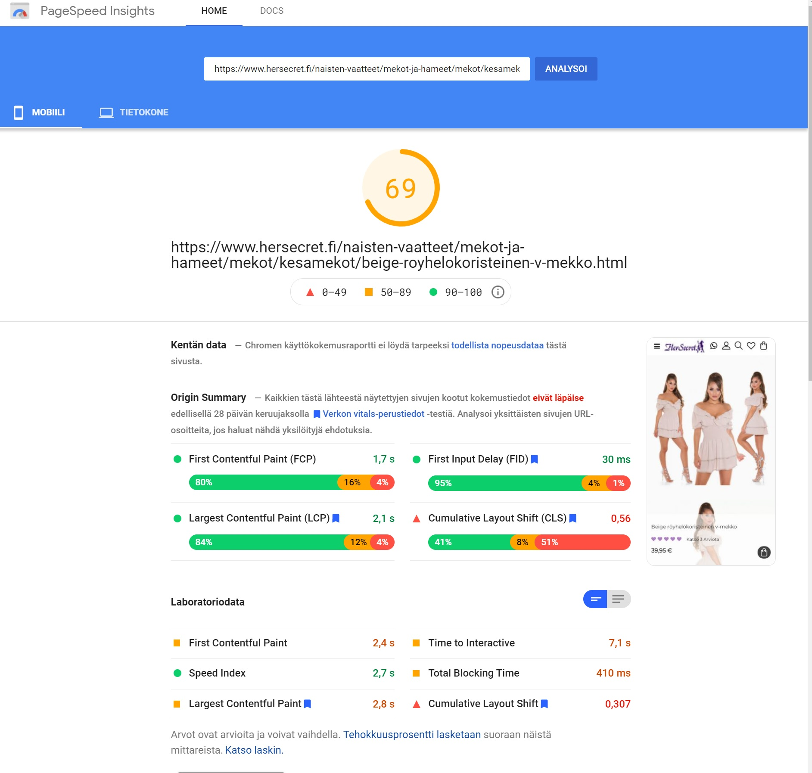

So here we can see a huge improvement, especially on the product page. And in the end we lose almost no functionatily compared to a native Prestashop theme. If it weren't for some of our custom plugins we would see +80 results on the product pages, too.

## Desktop

Even though it is not as important as it used to be, it's still a good idea to optimize the desktop results. On desktop you can reach close to 100 on Google pagespeed insights, with little optimization.

### Prestashop results on desktop

**Homepage**
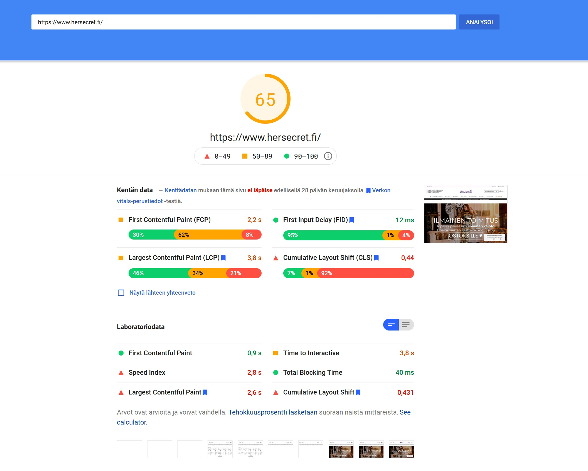

**Category page**
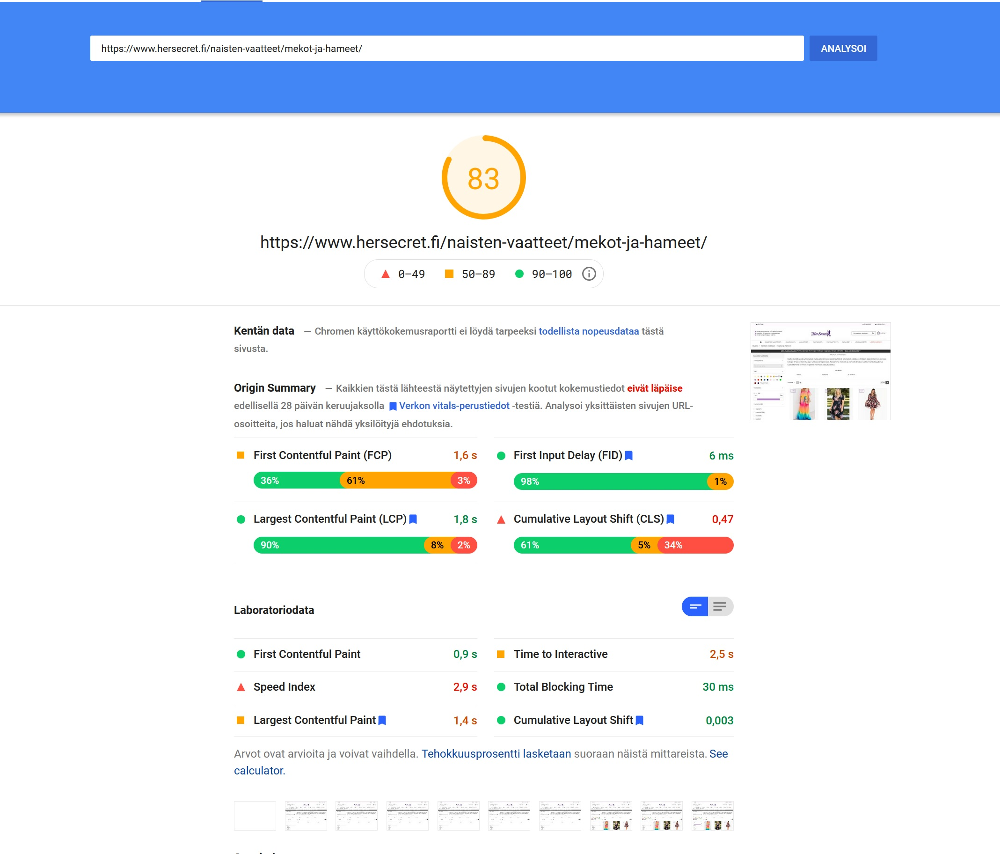

**Product page**
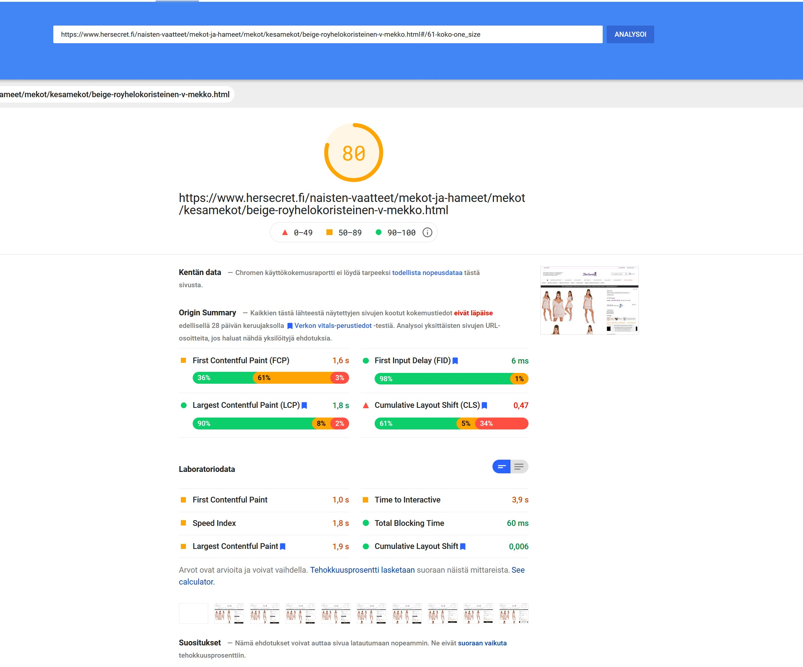

### React results on desktop

**Homepage**
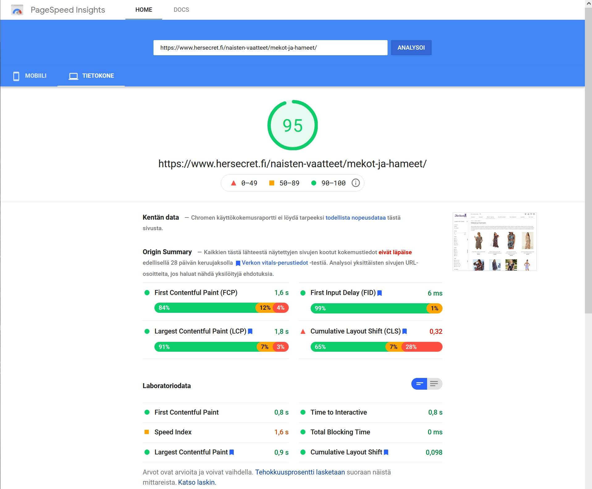

**Category page**

**Product page**
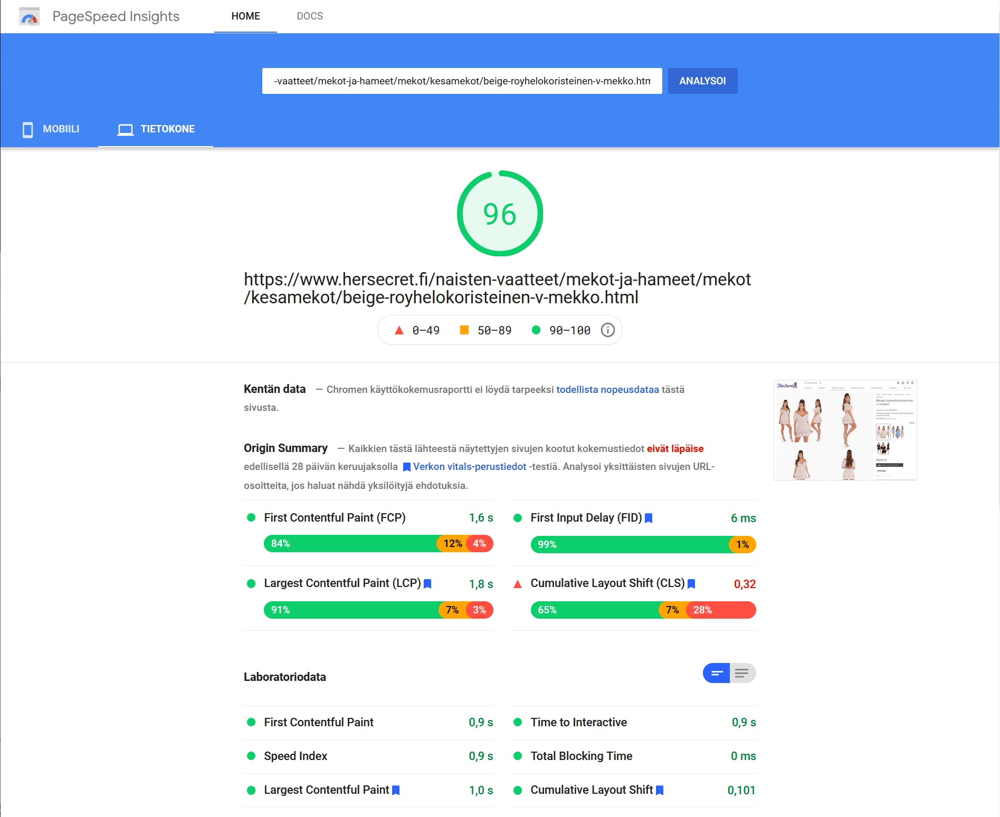

## Summary

Even though it has some caveats (e.g. rebuilding when you update some of your products, extra work for some of the custom modules you might want to use) I can recommend migrating to React. The performance and usability improvements far outweigh the negative sides of using React.

In my next posts I will dive into Google search console and analytics to see what is the real impact on the page speed (measured by Google) and how does the change impact our search rankings (might have revisit that after a while since the change will not be instant.)

If you are interested in trying how fast your Prestashop site can work as a SPA / React website, go ahead and launch a test site on <a href="https://blink-cart.com" target="_blank">Blink-cart.com</a>.

P.S. Currently we are working to improve the CLS (Cumulative Layout Shift) to improve the usability score and hence the Google search rankings.

# 30.6.2021 Update

We worked on the CLS of the product pages (on mobile) with the Blink Cart team and improved the results a lot. This is the new Google pagespeed result on the mobile (the mobile score was 69 and now we are scoring 79 on the Google pagespeed)

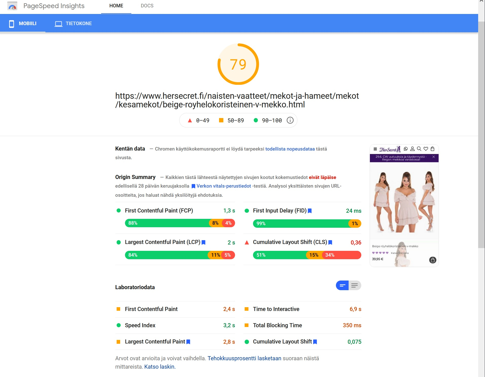
