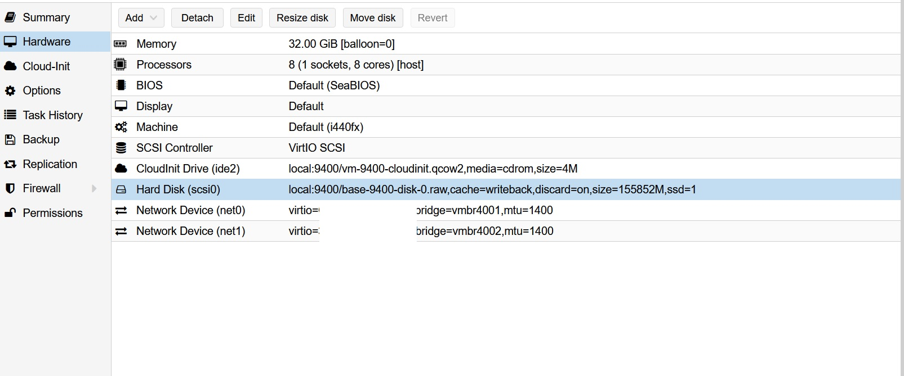

- [Why I chose K3s instead of K8s?](#why-i-chose-k3s-instead-of-k8s)
- [The process of migration](#the-process-of-migration)
  - [1. Creating a VM on Proxmox](#1-creating-a-vm-on-proxmox)
  - [2. Installing the Kubernetes tools locally](#2-installing-the-kubernetes-tools-locally)
  - [3. Installing K3s using k3sup](#3-installing-k3s-using-k3sup)
  - [4. Checking that my Kubernetes works](#4-checking-that-my-kubernetes-works)
  - [5. Installing Nginx Ingress controller and cert-manager](#5-installing-nginx-ingress-controller-and-cert-manager)
  - [6. Deploying Prestashop on Kubernetes using Helm](#6-deploying-prestashop-on-kubernetes-using-helm)
      - [External DB - settings](#external-db---settings)
  - [7. Migrating the Prestashop files from LXC](#7-migrating-the-prestashop-files-from-lxc)
  - [8. Migrating the DNS on Cloudflare](#8-migrating-the-dns-on-cloudflare)

# My motivation for the change <!-- omit in toc -->

I've found that LXC works well for some use cases but the Turnkeylinux´s <a href="https://www.turnkeylinux.org/prestashop" target="_blank">Prestashop container</a> image has some problems - for example I couldn't migrate my old container to a new server (I suspect it is something I did during the initial setup that effed up my container). Also I had some rare, albeit annoying performance issues which might be unrelated to the LXC container.

So when I needed to migrate the container to a new server, I decided to move the application to a more scalable environment - Kubernetes.

# Why I chose K3s instead of K8s?

I have played around a lot with K8s and I found it to be a bit too cumbersome to maintain when it comes to a small cluster. And when I decided to go with just one node, the decision became clear - I would go with K3s which is just a "lightweight K8s".

# The process of migration

## 1. Creating a VM on Proxmox

First I would have to create a VM on my Proxmox server, for this I used a Ubuntu cloudinit template.



Please note that the mtu=1400 is specific for the Proxmox (dedicated) servers on <a href="https://www.hetzner.com/dedicated-rootserver/matrix-ax" target="_blank">Hetzner</a> (they offer very good value servers for European customers).

As you can see for the network I will config two interfaces (one for Hetzner VLAN and the other for Internet). Once the server is setup and started, I will move on to install the K3s.

But first I will take a snapshot of the VM to be able to start afresh if anything were to go wrong.

## 2. Installing the Kubernetes tools locally

First I will install <a href="https://github.com/alexellis/arkade">arkade</a> (a Kubernetes marketplace) to make it easy to install everything.

Install Arkade first and the bash-completion

```
# Install Arkade using curl
curl -SLfs https://dl.get-arkade.dev | sudo sh
# Add the Arkade bin directory to PATH
echo "export PATH=\$HOME/.arkade/bin:\$PATH" >> ~/.bashrc
# Bash completion script
arkade completion bash > ~/arkade_bash_completion.sh
echo "source ~/arkade_bash_completion.sh" >> ~/.bashrc
source ~/.bashrc
```

Install Kubectl

```
# Installing Kubectl
arkade get kubectl
# Kubectl bash completion
echo 'source <(kubectl completion bash)' >>~/.bashrc
source ~/.bashrc
```

Install the rest of the tools (kustomize, helm, k3sup and kompose)

```
# Install Kustomize
arkade get kustomize
# Install Helm
arkade get helm
# Install K3sup
arkade get k3sup
# Install Kompose (can be used to convert docker-compose files)
curl -L https://github.com/kubernetes/kompose/releases/download/v1.22.0/kompose-linux-amd64 -o kompose
chmod +x kompose
sudo mv ./kompose /usr/local/bin/kompose
echo 'source <(kompose completion bash)' >>~/.bashrc
source ~/.bashrc
```

## 3. Installing K3s using k3sup

For K3s installation I chose <a href="https://github.com/alexellis/k3sup" target="_blank">k3sup</a> which will take care of the heavy lifting.

```
# run k3sup to install K3s, replace $IP and $USER with your data.

k3sup install \
  --ip $IP \
  --cluster \
  --user $USER \
  --k3s-channel stable \
  --local-path ~/.kube/config \
  --merge --context k3s \
  --k3s-extra-args '--no-deploy traefik --write-kubeconfig-mode 644'
```

## 4. Checking that my Kubernetes works

First I will test my config with the following (you should already have <a href="https://kubernetes.io/docs/tasks/tools/install-kubectl-linux/" target="_blank">kubectl</a> installed locally)

```

export KUBECONFIG=~/.kube/config
echo "export KUBE_CONFIG=~/.kube/config" >> .bashrc
kubectl config set-context k3s
kubectl get node -o wide

# I should get info about my node and it
# should be STATUS=ready in a few moments.

```

## 5. Installing Nginx Ingress controller and cert-manager

Now we can use arkade to install an ingress controller - so that we can host web applications on ports 80 and 443. We will go with Nginx (k3s includes traefik which we decided to disable when installing)

```
# nginx ingress controller
arkade install ingress-nginx --namespace default
# to manage letsencrypt certs
arkade install cert-manager
```

## 6. Deploying Prestashop on Kubernetes using Helm

Normally we would also need a distributed storage driver (for example Longhorn) to be able to use Prestashop on a HA kubernetes. But as we are using a single node setup, we will do without it.

Install Prestashop with helm:

```
#add your domain instead of $HOSTNAME
helm install my-prestashop \
--set resources.requests.memory=8Gi \
--set resources.requests.cpu=4 \
--set persistence.size=200Gi \
--set ingress.enabled=true \
--set ingress.CertManager=true \
--set ingress.hostname=$HOSTNAME \
bitnami/prestashop

```

By now we should have a plain Prestashop running at \$HOSTNAME but we can check with kubectl get pods.

#### External DB - settings

However, if you're like me and will use an external database, you should add the following lines above bitnami/prestashop

```
#replace db data with your data
--set mariadb.enabled=false \
--set externalDatabase.user=$DBUSER \
--set externalDatabase.password=$DBPASSWORD \
--set externalDatabase.database=$DATABASE \
--set externalDatabase.host=$HOST \
```

## 7. Migrating the Prestashop files from LXC

I will use tar to compress the Prestashop files (tar -zcvf archive-name.tar.gz source-directory-name) and then I will SCP the files to the Kubernetes server and then untar the files. For database I will use an external database - so I should backup the old database using mysqldump and then import it to the new database.

After the files have been migrated (for me it will take quite a while as we have a lot of image files), I will move the old files to the correct path (I will find it with kubectl get pv)

## 8. Migrating the DNS on Cloudflare

After everything is setup, I will just need to change my DNS to point to the new Kubernetes server IP.

Et voilà - I now have the Prestashop running on Kubernetes.

**Any questions or comments? Just let me know below :)**
